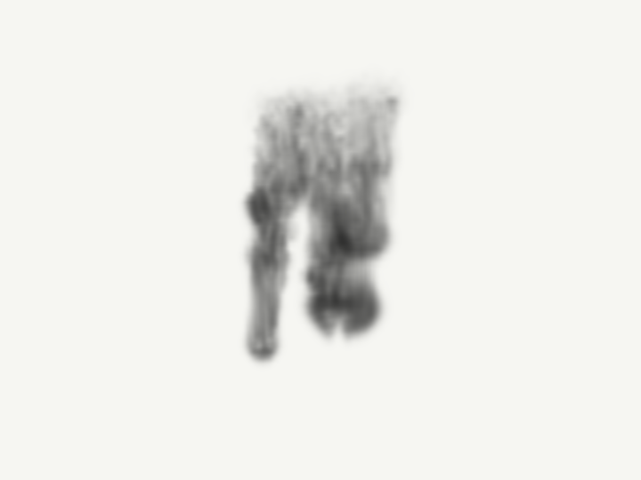

# KodeLife はじめの6レッスン

プログラミングやシェーダーが初めての方を想定した、約90〜120分の入門教材です。色、座標、形、時間を順に試して、最後に動く波紋を作ります。1日1〜2レッスンでも進められます。

## 新しいインク作品：墨の庭

[11. 触って描くインク](tutorials/11_interactive_ink.md)では、参考動画の黒いインクの広がりと、マウスで自由に描く操作を組み合わせました。速さで線の太さが変わり、色替え・にじみ調整・一時停止・PNG保存ができます。

[単体デモをダウンロード](inkplay/preview.html)してブラウザーで開いてください。白紙の上へ自分でインクを落とす2D版です。

## 応用チュートリアル：煙と水中のインク

入門6レッスンの次は、ノイズを使って流れるような表現を作ります。各45〜60分。どちらも同じ `resolution` と `time` を使い、1つのFragmentシェーダーで動かす教材です。

| 教材 | 作るもの | 完成コード |
| --- | --- | --- |
| [7. 立ちのぼる煙](tutorials/07_smoke.md) | 揺れて広がり、上で薄くなる煙 | [07_smoke.frag](shaders/07_smoke.frag) |
| [8. 水中に広がるインク](tutorials/08_ink_in_water.md) | 一滴が沈み、筋を含んで広がり、消える表現 | [08_ink_in_water.frag](shaders/08_ink_in_water.frag) |

完成形から白黒のノイズ・輪郭・濃度へ表示を切り替え、作り方を順に学べます。これらは流体らしい見た目を数式で作る2D表現で、物理的な流体シミュレーションではありません。

## 3D物理シミュレーションへ進む

[9. 3D流体：水中に墨を落とす](tutorials/09_fluid3d.md)では、速度・圧力・濃度を64³の格子で更新します。黒いインクと上昇する煙を、角度を変えて観察できる[単体デモ](fluid3d/preview.html)、GLSL一式、KodeLifeの配線手順を用意しました。デモHTMLはダウンロードしてブラウザーで開いてください。



ノイズ版とは別の数値計算を行う教材です。低解像度の基礎版で、参考動画と同等の実写品質ではありません。KodeLife用のネイティブプロジェクトは未同梱です。

## 雨粒と曇りガラス：Heartfelt

[10. HeartfeltをKodeLifeへ移植する](tutorials/10_heartfelt.md)では、BigWIngsさんの[原作](https://www.shadertoy.com/view/ltffzl)から雨粒・透明な軌跡・曇りガラスの表現を学びます。[完成コード](third_party/heartfelt/heartfelt_kodelife.frag)は画像なしでも動きます。

**ライセンスの例外：** Heartfeltの原作・移植版・描画例は **CC BY-NC-SA 3.0** です。ルートのMITライセンスはこれらには適用されません。[作者表記と利用条件](third_party/heartfelt/NOTICE.md)を参照してください。

## この教材の使い方

各レッスンのコードは全体をコピーして、KodeLifeの **Fragment** タブへ貼り付けます。前のレッスンの末尾に追加せず、Fragmentの内容を置き換えてください。同じコードは `shaders/` フォルダに番号順で保存しています。`.frag` はテキストのソースコードで、KodeLifeのプロジェクトファイルではありません。

まず動かす → 数字を1つ変える → 結果を観察する → 理由を読む、の順に進めましょう。数学の式を最初から全部覚える必要はありません。

## 0. 準備する（10〜15分）

### 対象環境を合わせる

この教材は **OpenGL 3.2以上／GLSL 150** 用です。Metalのシェーダーとは文法が異なります。KodeLifeは複数のGraphics APIに対応しているため、アプリ名が同じでもコードの書き方が一致するとは限りません。

1. 未インストールなら[公式サイト](https://hexler.net/kodelife)からKodeLifeを入手して起動します。
2. PreferencesのGeneralにある **Graphics API** でOpenGLを選べるか確認します。Projectの **Renderer** でも現在のバックエンドを確認できます。OpenGL 3.2以上が使える構成で進めてください。OpenGLが選べない環境では、このコードをMetalへそのまま貼らず、Metal向けの教材が必要です。
3. 新規プロジェクト、または画面全体に模様が出るシンプルなサンプルを用意します。既存の作品を使う場合は先に別名保存してください。
4. **1つのRender Passが画面全体を描く構成**を使います。既存のVertexシェーダーやメッシュ設定はそのまま使い、Fragmentだけを変更します。立体モデルを描くサンプルは、この教材の土台には向きません。
5. Projectの描画解像度を、まずは1280×720程度にします。Passにも同じ解像度を使わせてください。
6. Fragmentタブにレッスン1を貼り付け、画面全体が青くなれば土台は準備完了です。部分的にしか塗られない場合は、画面全体を覆う形状を描くプロジェクトへ戻ってください。

設定場所の根拠：[Preferences / General](https://hexler.net/kodelife/manual/preferences-general)、[Project](https://hexler.net/kodelife/manual/kontrolpanel-project)。UIの表記は言語やバージョンにより異なります。

### レッスン2以降の入力を接続する

右側の **Kontrol Panel** でFragmentのShader Stageを選び、Parametersに次の2つを追加します。既に同名のパラメーターがあれば重複して追加せず、内容を確認してください。上位のProjectやPassから同名の値が渡されていないかも確認します。

| GLSL側の名前 | KodeLifeで選ぶ組み込みパラメーター | GLSLの型 | 用途 |
| --- | --- | --- | --- |
| `resolution` | Frame → Resolution | `vec2` | 出力の幅・高さ |
| `time` | Clock | `float` | アニメーション用の時間 |

パラメーターの名前をコードと完全一致させます。大文字・小文字も区別されます。Clockは前進、Speedは1、Loopは無効を基本にします。**Timeという別の組み込みパラメーターではなく、Clockを選びます。** Timeは時・分・秒などを扱う別の入力です。

アプリ側でパラメーターを作ることと、コード側に `uniform` を宣言することの両方が必要です。`resolution` が未設定・ゼロのままだと、レッスン2以降は正しく描けません。最初は単一PassでProjectと同じ描画サイズを使うため、Frame Resolutionをそのまま利用できます。

公式の説明：[Parameters / Built-In](https://hexler.net/kodelife/manual/parameters-built-in)、[Kontrol Panel](https://hexler.net/kodelife/manual/kontrolpanel)。

### 画面で見る場所

- **Fragment**：今回編集する色の計算式。
- **描画プレビュー**：実際にできた絵を確認する場所。
- **Output panel**：コンパイルの警告やエラーを確認する場所。
- **Kontrol Panel**：解像度や入力パラメーターを設定する場所。

エディターと出力の説明は[公式Editorマニュアル](https://hexler.net/kodelife/manual/interface-editor)を参照してください。

## 1. 画面を好きな色にする

**目安：10分。成功すると画面全体が青くなります。**

`main()` は描画時に実行される処理です。フラグメントシェーダーでは、画面上の各地点の色を計算します。まずは「各ピクセルに同じ計算が適用される」と考えてください。

`vec3` は3つの数のまとまりで、ここでは赤・緑・青（RGB）を表します。各成分は、この教材では0.0〜1.0で指定します。`vec4(color, 1.0)` は透明度に関わるアルファ値を加えた4成分です。今回は1.0に固定します。`fragColor` が出力先です。

**やってみる：** `vec3(1.0, 0.3, 0.1)` に変更して、オレンジにしましょう。次に数字を1つずつ変えてください。

**理解チェック：** 黒は `vec3(0.0)`、白は `vec3(1.0)`。同じ値を3成分に入れる省略表記です。

### 貼り付けるコード

```glsl
#version 150
out vec4 fragColor;

void main()
{
    vec3 color = vec3(0.10, 0.55, 0.90);
    fragColor = vec4(color, 1.0);
}
```

## 2. 座標を色に変える

**目安：15分。成功すると、右ほど赤く、上ほど緑の強いグラデーションになります。**

ここからは準備で設定する `resolution` が必要です。`uniform` はアプリから受け取る値の宣言です。`vec2` は2つの数で、`resolution` には描画領域の幅と高さが入ります。

`gl_FragCoord.xy` は現在処理している地点のピクセル座標です。幅・高さでそれぞれ割ると、画面内の位置をほぼ0〜1で表せます。この位置を `uv` と名付けています。`uv` は自分で付けた変数名で、特別な命令ではありません。

OpenGLの通常のフラグメント座標では左下が原点です。ピクセルの中心を扱うため、端の値は厳密な0や1にはなりません。

**やってみる：** 色を `vec3(uv.x)` にすると左右の白黒グラデーション、`vec3(uv.y)` にすると上下になります。

**理解チェック：** 解像度で割るのは、画面サイズが変わっても位置を同じ尺度で扱うためです。

### 貼り付けるコード

```glsl
#version 150
uniform vec2 resolution;
out vec4 fragColor;

void main()
{
    vec2 uv = gl_FragCoord.xy / resolution;
    vec3 color = vec3(uv.x, uv.y, 0.25);
    fragColor = vec4(color, 1.0);
}
```

## 3. 中央に円を描く

**目安：20分。成功すると暗い背景の中央にミント色の円が出ます。**

最初に画面の半分を引いて中心を原点にします。次にxとyの両方を同じ高さ `resolution.y` で割ります。これで横長の画面でも円が横に伸びません。中心から上端までがおよそ0.5、下端までがおよそ−0.5です。

`float` は小数を扱う型。`length(p)` は原点からの距離です。円は「中心からの距離が半径より小さい場所」として作れます。半径0.25は画面の高さの25%で、直径は高さの50%です。

`smoothstep(a, b, d)` は、dがa以下なら0、b以上なら1、その間は滑らかに変化する関数です。`1.0 - ...` で反転して円の内側を1、外側を0にします。この白黒の判定値をマスクと呼びます。aはbより小さくします。

`mix(background, ink, mask)` は、マスクが0なら背景色、1なら円の色、中間なら混ざった色を返します。境界に幅を持たせてギザギザを和らげています。

**やってみる：** 半径を0.1、0.35に変える。`length(p - vec2(0.2, 0.0))` にして円を右へ移動する。

**理解チェック：** 円を左右に伸ばさないために、xもyも同じ値で割っています。

### 貼り付けるコード

```glsl
#version 150
uniform vec2 resolution;
out vec4 fragColor;

void main()
{
    vec2 p = (gl_FragCoord.xy - 0.5 * resolution) / resolution.y;
    float d = length(p);
    float radius = 0.25;
    float edge = 2.0 / resolution.y;
    float mask = 1.0 - smoothstep(radius - edge, radius + edge, d);
    vec3 background = vec3(0.02, 0.03, 0.08);
    vec3 ink = vec3(0.15, 0.85, 0.75);
    fragColor = vec4(mix(background, ink, mask), 1.0);
}
```

## 4. 円を動かす

**目安：15分。成功するとピンクの円が楕円軌道を動きながら伸縮します。**

`time` は準備で設定した **Clock** の値です。コードに名前を書くだけでは時間は入りません。アプリ側のパラメーターとの接続が必要です。

`sin` と `cos` は−1〜1の間を滑らかに往復します。引数はラジアンで、約6.283進むと1周します。Clockが毎秒1進む設定なら `sin(time)` の周期は約6.28秒です。

`0.25 * sin(time)` の0.25が移動の幅、`sin(time * 2.0)` の2.0が速さを調整します。半径は0.15を中心に±0.04変わるので、0.11〜0.19を往復します。

**やってみる：** 中心の式の `sin(time)` と `cos(time)` を両方 `sin(time * 0.5)`、`cos(time * 0.5)` にして軌道の動きを半分の速さにする。

**理解チェック：** `sin(time) * 2.0` は振れ幅を2倍、`sin(time * 2.0)` は速さを2倍にします。

### 貼り付けるコード

```glsl
#version 150
uniform vec2 resolution;
uniform float time;
out vec4 fragColor;

void main()
{
    vec2 p = (gl_FragCoord.xy - 0.5 * resolution) / resolution.y;
    vec2 center = vec2(0.25 * sin(time), 0.10 * cos(time));
    float radius = 0.15 + 0.04 * sin(time * 2.0);
    float d = length(p - center);
    float edge = 2.0 / resolution.y;
    float mask = 1.0 - smoothstep(radius - edge, radius + edge, d);
    vec3 color = mix(vec3(0.02, 0.03, 0.08), vec3(1.0, 0.35, 0.55), mask);
    fragColor = vec4(color, 1.0);
}
```

## 5. 模様を繰り返す

**目安：15分。成功すると黄色い水玉が並んで伸縮します。**

`fract(x)` は `x - floor(x)`、つまり小数部分を返します。例えば1.2は0.2、2.2も0.2です。負の値でも結果は0以上1未満になります。

`p * tiles` を `fract` に入れると、座標が何度も0〜1へ折り返されます。0.5を引いて各マスの中心を原点にすると、前のレッスンの円の式を各マスで再利用できます。

`tiles = 5.0` は画面の高さ全体で5周期という意味です。横方向の数は画面の縦横比によって変わり、端で円が切れる場合もあります。`edge` にもtilesを掛け、座標の拡大に合わせています。

**やってみる：** tilesを3.0、8.0に変更する。`fract(p * tiles + vec2(time * 0.2, 0.0))` にすると模様が横へ流れます。

**理解チェック：** 円を1個ずつ描く命令を並べず、座標を繰り返すことで同じ式から模様ができます。

### 貼り付けるコード

```glsl
#version 150
uniform vec2 resolution;
uniform float time;
out vec4 fragColor;

void main()
{
    vec2 p = (gl_FragCoord.xy - 0.5 * resolution) / resolution.y;
    float tiles = 5.0;
    vec2 cell = fract(p * tiles) - 0.5;
    float radius = 0.25 + 0.07 * sin(time * 2.0);
    float edge = 2.0 * tiles / resolution.y;
    float mask = 1.0 - smoothstep(radius - edge, radius + edge, length(cell));
    vec3 color = mix(vec3(0.04, 0.03, 0.10), vec3(0.95, 0.65, 0.20), mask);
    fragColor = vec4(color, 1.0);
}
```

## 6. 作品：色が流れる波紋

**目安：15分。成功すると青紫とシアンの同心円が外側へ流れます。**

`d` は中心からの距離です。同じ距離の場所に同じ色を出すので同心円になります。`sin(d * frequency - time * speed)` で距離と時間の両方を色に反映します。

`sin` の−1〜1を `0.5 + 0.5 * ...` で0〜1へ変換すると、そのまま2色を混ぜる割合に使えます。`frequency` を大きくすると波が細かくなり、`speed` を大きくすると色の変化が速くなります。

最後の2行で外側を少し暗くしています。`color *= ...` は `color = color * ...` の省略です。

**やってみる：** frequencyを14.0、50.0に変える。speedを−1.2にすると波の進む方向が逆になります。2色を好みの組み合わせにしてください。

**完成課題：** 「落ち着いた波」「鮮やかな波」「逆向きの波」の3作品を別名保存し、変えた値をメモする。

**理解チェック：** 模様の形は座標、動きは時間、見た目は色の組み合わせで変えられます。

### 貼り付けるコード

```glsl
#version 150
uniform vec2 resolution;
uniform float time;
out vec4 fragColor;

void main()
{
    vec2 p = (gl_FragCoord.xy - 0.5 * resolution) / resolution.y;
    float speed = 1.2;
    float frequency = 28.0;
    float d = length(p);
    float wave = 0.5 + 0.5 * sin(d * frequency - time * speed);
    vec3 darkColor = vec3(0.03, 0.02, 0.16);
    vec3 lightColor = vec3(0.15, 0.85, 0.95);
    vec3 color = mix(darkColor, lightColor, wave);
    float vignette = 1.0 - smoothstep(0.25, 0.85, d);
    color *= 0.30 + 0.70 * vignette;
    fragColor = vec4(color, 1.0);
}
```

## 困ったときの確認表

| 症状 | 確認・対処 |
| --- | --- |
| `#version` や `out` でエラー | RendererがOpenGLで、GLSL 150を扱えるか確認。Metalや古いGLSLではこのまま使えません。 |
| 黒いまま | レッスン1へ戻る。1も出なければPass・ProjectのEnabledや全画面描画の土台を確認。1は出るならresolutionの接続を確認。 |
| エラー後に絵が変わらない | 古い描画結果が残る場合があります。Output panelで先頭のエラーから直します。 |
| `undeclared identifier` | 変数の宣言、綴り、コピー漏れを確認します。 |
| `syntax error` | 行末の `;`、括弧 `()`、波括弧 `{}` を確認。エラー表示の1行前も見ます。 |
| 型が合わないエラー | `float`、`vec2`、`vec3`、`vec4` の成分数を確認。小数には `1.0` のような表記を使います。 |
| 円が伸びる・中心がずれる | コードが `.y` で割っているか、Passの描画サイズとresolutionが一致するか確認。 |
| 動かない | timeの入力がClockか、停止・Speed 0になっていないか、Projectが更新中か確認。 |
| 動作が重い | まず解像度を640×360へ下げ、不要なPassを無効化して確認。 |

## 学んだことを定着させる

1. 円を左上へ移動し、色をオレンジにする。
2. 円の位置を固定して、半径だけ変化させる。
3. 水玉の数を増やし、ゆっくり横に流す。
4. 波紋を内側へ流し、好みの2色へ変える。

答えのヒント：1は `p - vec2(-0.2, 0.2)`、2はcenterを `vec2(0.0)`、3はtilesとfractの入力、4はspeedの符号と2つの色です。

各作品をKodeLifeの保存機能で別名保存します。コードだけの `.frag` に加えてプロジェクトも保存すると、パラメーターや描画設定を含めて再開できます。「変更した値／予想／実際の結果」を1行ずつ残すと、次に作るときの引き出しになります。

この6レッスンの後は、マウス操作、音に反応する色・形、前フレームを使う残像の順に進むと、今回の基礎を応用できます。

## 制作・確認について

公式マニュアルの確認日：2026年9月16日。コードと演習は本教材用に作成しました。ローカルのKodeLife画面は操作権限がなく確認できなかったため、KodeLife実機でのコンパイル・描画確認は未実施です。UI操作手順は公式資料に基づきます。
