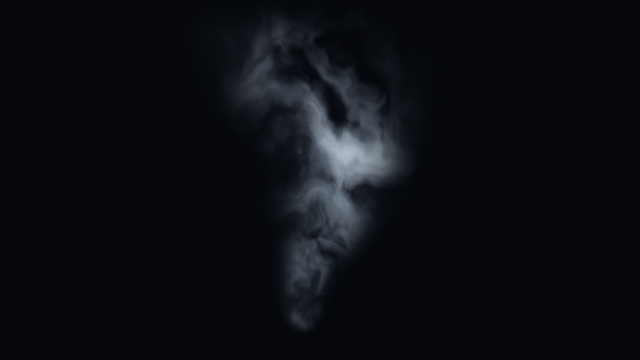

# 7. 煙：立ちのぼって揺れる煙を作る

目安45〜60分。入門のレッスン3・4・6を終えた方向けです。暗い背景の下中央から、灰青色の煙が上へ流れ、広がりながら薄くなる表現を作ります。



640×360、Clock値5でのOpenGL描画例。

## KodeLifeの準備

[入門教材の準備](../README.md#0-準備する1015分)と同じ **OpenGL 3.2以上／GLSL 150、全画面を描く1つのRender Pass** を使います。まず640×360で試し、余裕があれば1280×720へ上げてください。Vertexシェーダーはそのままにして、Fragmentのコード全体を置き換えます。

| 名前 | Parametersで割り当てる入力 | GLSL型 |
| --- | --- | --- |
| `resolution` | Built-In → Frame → Resolution | `vec2` |
| `time` | Built-In → Clock（前進、Speed 1） | `float` |

ProjectとPassの描画解像度を揃えます。名前の大文字・小文字を一致させ、上位階層に同名の入力があれば重複追加しません。テクスチャやPrevious Frameは不要です。時間を最初から見たいときはClockの値を0へ戻します。

## 共通の道具：ノイズを重ねる

`hash21` は格子の位置から0〜1のばらついた値を作ります。`valueNoise` は格子の四隅の値を滑らかにつないだ、2次元のバリューノイズです。`f * f * (3.0 - 2.0 * f)` がつなぎ目を滑らかにします。

`fbm` は大きさの違うノイズを5回重ねます。周波数を約2倍、強さを半分にし、大きなうねりの上へ細かな変化を足します。最後の0.96875は5回分の強さの合計です。ノイズの座標を回転・移動させ、格子方向の癖を目立ちにくくしています。

さらに、ノイズの値で別のノイズを読む座標を曲げます。これを **ドメインワーピング（座標の歪み）** と呼びます。形を細かく描き込まずに、流れのような輪郭を作れます。

この教材は1フレームごとに位置と時間から絵を計算する、2Dの手続き的な表現です。速度場・圧力・物質の保存を計算する流体シミュレーションではありません。前フレームの状態も保持しないため、障害物との衝突やマウスで継続的にかき混ぜる操作は扱いません。

## まず完成形を動かす

[完成コード](../shaders/07_smoke.frag)をFragmentへ貼り付けます。`VIEW = 0` が完成表示です。上へ流れる濃淡と、上ほど太くなる煙の帯を確認してください。

## ステップ1：煙の濃淡を観察する

`const int VIEW = 0;` の0を1へ変更します。画面全体に白黒の雲のような模様が出ます。白ほどノイズ値が高い部分です。

`flow` の `h * 2.8 - t` はノイズを上へ動かします。固定の模様を読む位置が時間とともに下がるため、画面では模様が上へ移動して見えます。`- t` を `+ t` にすると逆方向です。変更を戻してから次へ進みます。

## ステップ2：煙が存在する範囲を作る

VIEWを2にします。煙の輪郭を表す `envelope` が見えます。

- `h = p.y + 0.43`：煙の根元を画面中央より下へ配置。
- `width = 0.025 + 0.19 * height`：上ほど煙を太くする。
- `exp(-pow(x / width, 2.0) * 1.4)`：中心が濃く、左右へ滑らかに薄くなる帯。
- 2つのsmoothstep：根元を立ち上げ、上端へ近づくと消す。

`warp.x` が中心線を不規則に揺らします。`height` を掛けるため根元の揺れは小さく、上ほど大きくなります。

## ステップ3：輪郭と濃淡を掛ける

VIEWを3にします。`density = envelope * ...` によって、帯の外は黒、帯の内側だけに細かな濃淡が残ります。これが煙の「密度に相当する絵」です。実際の質量密度を計算しているわけではありません。

## ステップ4：色と透明感を付ける

VIEWを0へ戻します。`1.0 - exp(-density * 3.2)` は密度を0〜1の混合率に変えます。密度が増えるほど煙の色へ近づき、濃いところで急に値が跳ねません。背景との合成はシェーダー内部で行い、出力アルファは1です。

## 数字を変えて作品にする

| 変更箇所 | 試す値 | 観察すること |
| --- | --- | --- |
| `time * 0.35` | 0.15 / 0.65 | 時間変化全体の速さ |
| widthの `0.19` | 0.10 / 0.28 | 上部の広がり |
| warp.xの `0.24` | 0.10 / 0.40 | 輪郭の揺れ幅 |
| opacityの `3.2` | 1.5 / 5.0 | 煙の濃さ |

**練習：** 「細い線香の煙」「太い舞台の煙」を別名保存してください。まず幅と濃さだけ変え、最後に揺れを調整します。

**理解チェック：** VIEW 1は画面全体に模様があるのに、完成形が煙の帯になる理由は？ → ノイズにenvelopeを掛け、存在する範囲を制限しているからです。

## 困ったとき

- 全体が黒い／表示されない：入門レッスン1に戻り、OpenGL、全画面の形状、resolutionの設定を確認します。
- 動かない：timeがClockにつながっているか確認。デバッグ中もClockを動かします。
- インクが見えない：周期の最後は消えています。Clockを0へ戻し、数秒進めます。
- 重い：解像度を640×360へ下げます。fbmを3回に減らすなら、ループの5を3へ、正規化の0.96875を0.875へ同時に変更します。細部は減ります。
- 色が白黒：VIEWを0へ戻します。

関数の仕様：[Khronos GLSL仕様・組み込み関数](https://registry.khronos.org/OpenGL/specs/gl/GLSLangSpec.4.60.html#built-in-functions)。参照先は新版ですが、ここではGLSL 150で使える関数のみを使用しています。

## 完成コード

以下はリンク先の `.frag` と同一です。全体をFragmentへ貼り付けてください。

```glsl
#version 150
uniform vec2 resolution;
uniform float time;
out vec4 fragColor;

// 0: finished image, 1: noise, 2: shape, 3: density
const int VIEW = 0;

float hash21(vec2 p)
{
    p = fract(p * vec2(123.34, 456.21));
    p += dot(p, p + 45.32);
    return fract(p.x * p.y);
}

float valueNoise(vec2 p)
{
    vec2 i = floor(p);
    vec2 f = fract(p);
    vec2 u = f * f * (3.0 - 2.0 * f);
    return mix(mix(hash21(i), hash21(i + vec2(1.0, 0.0)), u.x),
               mix(hash21(i + vec2(0.0, 1.0)), hash21(i + vec2(1.0)), u.x), u.y);
}

float fbm(vec2 p)
{
    float value = 0.0;
    float amplitude = 0.5;
    mat2 rotation = mat2(0.8, -0.6, 0.6, 0.8);
    for (int i = 0; i < 5; ++i)
    {
        value += amplitude * valueNoise(p);
        p = rotation * p * 2.03 + vec2(13.1, 7.7);
        amplitude *= 0.5;
    }
    return value / 0.96875;
}

void main()
{
    vec2 p = (gl_FragCoord.xy - 0.5 * resolution) / resolution.y;
    float t = time * 0.35;
    float h = p.y + 0.43;
    float height = clamp(h, 0.0, 1.0);
    float width = 0.025 + 0.19 * height;
    float drift = 0.045 * sin(height * 7.0 - t);
    vec2 flow = vec2(p.x * 3.5, h * 2.8 - t);
    vec2 warp = vec2(fbm(flow + vec2(0.0, 3.4)),
                     fbm(flow + vec2(5.2, 0.0))) - 0.5;
    float x = p.x - drift + warp.x * 0.24 * height;
    float envelope = exp(-pow(x / width, 2.0) * 1.4);
    envelope *= smoothstep(0.0, 0.06, h) * (1.0 - smoothstep(0.50, 0.95, h));
    float textureValue = fbm(flow * 2.0 + warp * 2.8);
    float density = envelope * smoothstep(0.18, 0.80, textureValue);
    float opacity = 1.0 - exp(-density * 3.2);
    vec3 background = vec3(0.018, 0.026, 0.045);
    vec3 smokeColor = mix(vec3(0.28, 0.34, 0.43), vec3(0.82, 0.87, 0.91), textureValue);
    vec3 color = mix(background, smokeColor, opacity);
    if (VIEW == 1) color = vec3(textureValue);
    if (VIEW == 2) color = vec3(envelope);
    if (VIEW == 3) color = vec3(density);
    fragColor = vec4(color, 1.0);
}
```

## 検証状況

2026年9月27日、macOSのOpenGL CoreコンテキストでGLSL 150のコンパイル・リンク・描画を確認しました。Clock値0、2、5、10、13.9、14を描画し、5の画像を目視確認しています。KodeLifeアプリ内の操作・描画は未確認です。
