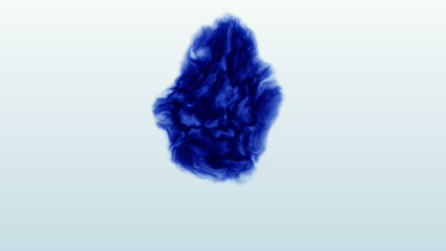

# 8. 水中のインク：一滴が沈みながら広がる表現

> マウスで描く最新版は[11. 墨の庭：触って描くインク](11_interactive_ink.md)へ。参考動画の正面から広がる表情を2Dで描けます。


目安45〜60分。レッスン7のノイズと座標の歪みを応用します。横から水槽を見るイメージで、上部の一滴が沈み、青紫色の筋を含んだ塊へ広がり、薄く消える映像を作ります。



640×360、Clock値5でのOpenGL描画例。

## KodeLifeの準備

[入門教材の準備](../README.md#0-準備する1015分)と同じ **OpenGL 3.2以上／GLSL 150、全画面を描く1つのRender Pass** を使います。まず640×360で試し、余裕があれば1280×720へ上げてください。Vertexシェーダーはそのままにして、Fragmentのコード全体を置き換えます。

| 名前 | Parametersで割り当てる入力 | GLSL型 |
| --- | --- | --- |
| `resolution` | Built-In → Frame → Resolution | `vec2` |
| `time` | Built-In → Clock（前進、Speed 1） | `float` |

ProjectとPassの描画解像度を揃えます。名前の大文字・小文字を一致させ、上位階層に同名の入力があれば重複追加しません。テクスチャやPrevious Frameは不要です。時間を最初から見たいときはClockの値を0へ戻します。

## 共通の道具：ノイズを重ねる

`hash21` は格子の位置から0〜1のばらついた値を作ります。`valueNoise` は格子の四隅の値を滑らかにつないだ、2次元のバリューノイズです。`f * f * (3.0 - 2.0 * f)` がつなぎ目を滑らかにします。

`fbm` は大きさの違うノイズを5回重ねます。周波数を約2倍、強さを半分にし、大きなうねりの上へ細かな変化を足します。最後の0.96875は5回分の強さの合計です。ノイズの座標を回転・移動させ、格子方向の癖を目立ちにくくしています。

さらに、ノイズの値で別のノイズを読む座標を曲げます。これを **ドメインワーピング（座標の歪み）** と呼びます。形を細かく描き込まずに、流れのような輪郭を作れます。

この教材は1フレームごとに位置と時間から絵を計算する、2Dの手続き的な表現です。速度場・圧力・物質の保存を計算する流体シミュレーションではありません。前フレームの状態も保持しないため、障害物との衝突やマウスで継続的にかき混ぜる操作は扱いません。

## まず完成形を動かす

[完成コード](../shaders/08_ink_in_water.frag)をFragmentへ貼り付けます。Clockが毎秒1進む設定なら、14秒で1回の滴下を繰り返します。最初は小さく、2〜8秒で広がり、10〜14秒で消えます。リセット直前・直後は水だけになるため、輪郭が急に戻るのを隠せます。

## ステップ1：一滴の成長を見る

VIEWを2に変更します。白い領域が小さな滴から大きな塊へ広がります。

`age = mod(max(time, 0.0), 14.0)` は0〜14の繰り返し時間です。`growth = 1.0 - exp(-age * 0.32)` で最初は速く、後半ほど緩やかに広がります。

中心のy座標を `0.25 - 0.035 * min(age, 9.0)` で下げ、9秒後には沈降を止めます。半径はgrowthとともに増えます。これは見た目のための動きで、重力や拡散方程式を解いた結果ではありません。

VIEW 2は形だけを表示するので、14秒ごとに小さな形へ戻るのが見えます。完成表示のフェードはこのデバッグ表示には適用していません。

## ステップ2：輪郭をほぐす

`curled = q + warp * (0.025 + 0.25 * growth)` が輪郭を歪めます。成長するほど歪みを強め、真円のまま拡大する見た目を避けています。

試しに0.025と0.25を両方0.0にすると、ほぼ楕円のまま成長します。元へ戻し、違いを見てください。変数名curledは歪めた座標を意味しており、流体力学の渦度を計算しているわけではありません。

## ステップ3：内部に筋と濃淡を作る

VIEWを1にすると内部に使うノイズ、3にすると最終的な濃度が見えます。

`1.0 - abs(2.0 * textureValue - 1.0)` はノイズが0.5付近の場所を明るくする式です。`pow(..., 3.0)` で明るい帯を絞り、筋のような濃淡にします。

`fade` は出現と消失を滑らかにし、`1.0 + age * 0.12` で割ることで時間とともに濃度を下げます。半径が増えた分の総量を保存する計算ではないので、濃さは見た目で調整します。

## ステップ4：インクが光を吸う色を作る

VIEWを0へ戻します。`water * exp(-absorption * density * 2.5)` で濃い部分ほど背景から光を減らします。吸収の考え方を簡略化した色付けで、光路の積分や水面の屈折は行いません。

`absorption` はインクのRGB色を直接指定する値ではなく、各色をどれだけ減らすかです。赤を強く、青を弱く減らす設定なので青紫に見えます。白へ足す煙の合成とは異なり、明るい水から色を減らすことでインクの濃さを表します。

## 数字を変えて作品にする

| 変更箇所 | 試す値 | 観察すること |
| --- | --- | --- |
| growthの `0.32` | 0.16 / 0.55 | 広がりの速さ |
| centerの `0.035` | 0.015 / 0.055 | 沈む速さ |
| radiusの `0.32` | 0.22 / 0.40 | 最大の広がり |
| warpの `0.25` | 0.10 / 0.38 | 輪郭のほぐれ方 |
| absorption | `vec3(0.5, 3.2, 2.3)` | 赤系のインク |
| 吸収式の `2.5` | 1.2 / 4.0 | 薄墨／濃いインク |

**練習：** ゆっくり広がる青いインクと、速く沈む赤いインクを作ってください。1周期を比較して、輪郭が画面外に切れない範囲へ半径を調整します。

**理解チェック：** 赤いインクにしたいとき、赤の吸収を強くする？ → 弱くします。赤い光を残すためです。

**発展：** 今回は1滴の形を時間で変えています。複数の滴の相互作用や、かき混ぜた跡の保持へ進むなら、複数Passで速度と色を保存する移流・拡散の教材が次の段階になります。

## 困ったとき

- 全体が黒い／表示されない：入門レッスン1に戻り、OpenGL、全画面の形状、resolutionの設定を確認します。
- 動かない：timeがClockにつながっているか確認。デバッグ中もClockを動かします。
- インクが見えない：周期の最後は消えています。Clockを0へ戻し、数秒進めます。
- 重い：解像度を640×360へ下げます。fbmを3回に減らすなら、ループの5を3へ、正規化の0.96875を0.875へ同時に変更します。細部は減ります。
- 色が白黒：VIEWを0へ戻します。

関数の仕様：[Khronos GLSL仕様・組み込み関数](https://registry.khronos.org/OpenGL/specs/gl/GLSLangSpec.4.60.html#built-in-functions)。参照先は新版ですが、ここではGLSL 150で使える関数のみを使用しています。

## 完成コード

以下はリンク先の `.frag` と同一です。全体をFragmentへ貼り付けてください。

```glsl
#version 150
uniform vec2 resolution;
uniform float time;
out vec4 fragColor;

// 0: finished image, 1: noise, 2: shape, 3: density
const int VIEW = 0;

float hash21(vec2 p)
{
    p = fract(p * vec2(123.34, 456.21));
    p += dot(p, p + 45.32);
    return fract(p.x * p.y);
}

float valueNoise(vec2 p)
{
    vec2 i = floor(p);
    vec2 f = fract(p);
    vec2 u = f * f * (3.0 - 2.0 * f);
    return mix(mix(hash21(i), hash21(i + vec2(1.0, 0.0)), u.x),
               mix(hash21(i + vec2(0.0, 1.0)), hash21(i + vec2(1.0)), u.x), u.y);
}

float fbm(vec2 p)
{
    float value = 0.0;
    float amplitude = 0.5;
    mat2 rotation = mat2(0.8, -0.6, 0.6, 0.8);
    for (int i = 0; i < 5; ++i)
    {
        value += amplitude * valueNoise(p);
        p = rotation * p * 2.03 + vec2(13.1, 7.7);
        amplitude *= 0.5;
    }
    return value / 0.96875;
}

void main()
{
    vec2 p = (gl_FragCoord.xy - 0.5 * resolution) / resolution.y;
    // A single drop repeats every 14 clock units, fading out before reset.
    float age = mod(max(time, 0.0), 14.0);
    float growth = 1.0 - exp(-age * 0.32);
    vec2 center = vec2(0.0, 0.25 - 0.035 * min(age, 9.0));
    vec2 q = p - center;
    vec2 flow = q * 3.2 + vec2(0.0, age * 0.10);
    vec2 warp = vec2(fbm(flow + vec2(2.3, 0.0)),
                     fbm(flow + vec2(0.0, 8.1))) - 0.5;
    vec2 curled = q + warp * (0.025 + 0.25 * growth);
    float radius = 0.025 + 0.32 * growth;
    float distanceToDrop = length(curled * vec2(1.0, 0.82));
    float envelope = 1.0 - smoothstep(radius * 0.65, radius, distanceToDrop);
    float textureValue = fbm(curled * 15.0 + warp * 3.0 + vec2(0.0, age * 0.14));
    float veins = pow(1.0 - abs(2.0 * textureValue - 1.0), 3.0);
    float fade = smoothstep(0.0, 0.7, age) * (1.0 - smoothstep(10.0, 14.0, age));
    float density = envelope * (0.22 + 1.3 * veins) * fade / (1.0 + age * 0.12);
    vec3 water = mix(vec3(0.78, 0.87, 0.90), vec3(0.96, 0.98, 0.97), gl_FragCoord.y / resolution.y);
    // RGB absorption: red is absorbed most, leaving blue/purple ink.
    vec3 absorption = vec3(3.8, 2.7, 0.65);
    vec3 color = water * exp(-absorption * density * 2.5);
    if (VIEW == 1) color = vec3(textureValue);
    if (VIEW == 2) color = vec3(envelope);
    if (VIEW == 3) color = vec3(density);
    fragColor = vec4(color, 1.0);
}
```

## 検証状況

2026年9月27日、macOSのOpenGL CoreコンテキストでGLSL 150のコンパイル・リンク・描画を確認しました。Clock値0、2、5、10、13.9、14を描画し、5の画像を目視確認しています。KodeLifeアプリ内の操作・描画は未確認です。
