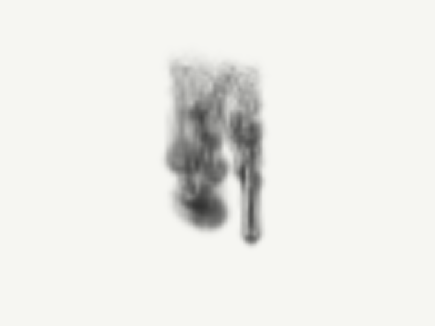
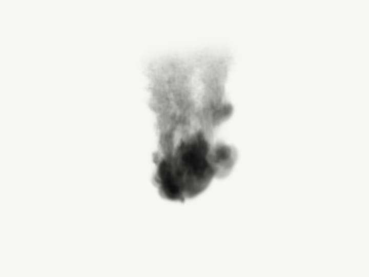
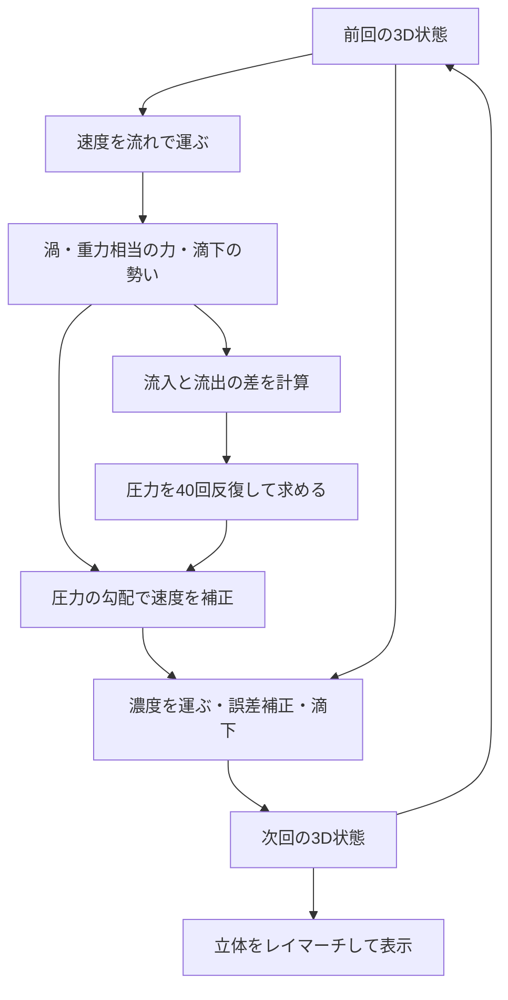

# 9. 3D流体：水中に墨を落とす

> マウスで描く最新版は[11. 墨の庭：触って描くインク](11_interactive_ink.md)へ。参考動画の正面から広がる表情を2Dで描けます。


目安：デモでの観察30分、流体計算の学習2〜3時間、KodeLifeへの手動配線は別途。入門6レッスンと、煙・インクのノイズ版を終えた方向けです。

[参考動画](https://www.youtube.com/watch?v=i2x9PEIYFeM)で見られる「白い背景に黒いインクが重なり、奥行きのある渦を作る」方向を目指した3Dの基礎実装です。**動画と同等の写真のような再現ではありません。** 標準は64³の低解像度なので、極細の筋や薄い膜は太く、柔らかくなります。

今回はノイズで濃度の模様を作らず、3Dの速度・圧力・濃度を毎ステップ更新します。滴下口から物質と勢いを加え、流れに運ばれた結果を描きます。

## まず動かす

一番簡単なのは [単体デモHTML](../fluid3d/preview.html) をダウンロードし、WebGL2対応ブラウザーで開く方法です。GitHub上ではHTMLのソースが表示されるため、ファイルを保存して開いてください。外部ライブラリ、npm、APIキーは不要です。サーバーを使う場合は、リポジトリのルートから次を実行します。

```sh
python3 -m http.server 8765 --bind 127.0.0.1 --directory fluid3d/demo
```

その後 [ローカルデモ](http://127.0.0.1:8765/) を開きます。終了するときはターミナルでCtrl+C。

1. 最初の約2秒で、少し位置とタイミングが違う3つの滴下口から墨が入ります。
2. 「8秒まで計算」を押すと、計算時間8秒で止まります。
3. 「見る角度」を変えるか、絵をドラッグして回転します。停止したまま横から見ても形があることを確認します。
4. 「中央の断面」へ切り替えると、奥行きの中央を切った濃度が見えます。
5. 「最初から」で状態と計算時間を消去し、もう一度滴下します。
6. 「上昇する煙」へ切り替えると、下から連続注入される煙になります。

デモは同じGLSL計算をWebGL2用に変換して動かします。描画サイズを下げるとレイマーチの負荷が下がり、圧力反復を減らすと計算負荷が下がります。描画サイズを上げても、流体の格子は変わりません。「流体の解像度」で64³／96³／128³を選びます。変更時は状態を初期化し、96³以上では圧力反復を80回に設定します。


同じ計算状態を横から見ると、奥行きが確認できます。



128³・80反復の8秒時点です。細部は増えますが、実写の薄い膜や極細の筋にはまだ差があります。



## 1. 画面の色ではなく、空間の状態を保存する

前の教材では各ピクセルの色を直接求めました。今回は一辺64個、合計262,144個のセルを持つ立方体を使います。

| 保存先 | 値 | 意味 |
| --- | --- | --- |
| StateのR | x方向の速度 | 左右へ動く速さ |
| StateのG | y方向の速度 | 上下へ動く速さ |
| StateのB | z方向の速度 | 手前・奥へ動く速さ |
| StateのA | インク／煙の濃度 | その場所にどれだけ存在するか |
| PressureのR | 圧力補正用の値 | 流れの圧縮・膨張を減らす |
| ClockのR | 計算時間 | 1ステップごとにdtだけ増える |

速度は各セルの正方向の面に置き、濃度と圧力はセルの中心に置きます。これをMAC型の格子と呼びます。RGBAに同居させていますが、速度と濃度の位置は半セルずれています。その差を `velocityAt()` が補間します。

ここでの速度の単位は「セル／計算秒」、セル間隔は1です。圧力用の値は時間刻みなどを吸収した補正量で、パスの値をそのままPaとして解釈しません。

## 2. 3Dを2Dテクスチャに並べる

KodeLifeのRender Passで扱いやすいよう、64枚の奥行きスライスを8列×8行に並べ、**512×512**の画像に保存します。画像としては2Dでも、隣接セルの計算はx・y・zの3方向で行います。

```text
z = 0〜7     → 1行目の8枚
z = 8〜15    → 2行目の8枚
…
z = 56〜63   → 8行目の8枚
各スライスは64×64
```

`atlasPixel()` がセル番号を画像上の場所に変えます。`sampleField()` は各スライス内を補間し、さらに前後の2スライスを混ぜて3Dの補間を行います。スライスの端を越えて隣のタイルの値が混ざらないよう、座標を制限しています。

## 3. 毎ステップの処理



### 速度を運ぶ：移流

[`01_advect_velocity.frag`](../fluid3d/shaders/01_advect_velocity.frag)では、「今ここに来た流体は、少し前にはどこにいたか」を速度から逆向きにたどり、その場所の速度を読みます。これが半ラグランジュ法による移流です。中間地点で速度を読み直すRK2の逆追跡を使います。

### 外力と渦

[`02_curl.frag`](../fluid3d/shaders/02_curl.frag)は流れの回転を求めます。[`03_forces.frag`](../fluid3d/shaders/03_forces.frag)は、濃度に応じてインクなら下、煙なら上へ力を加えます。滴下口には局所的な下向き／上向きの勢いと、小さく変化する横方向の勢いを与えます。

「渦の補強」は、粗い格子で失われる回転を補うvorticity confinementです。物理的な粘性係数ではありません。0にすると補強を外せます。大きすぎると格子状のざらつきが増えるので、まず0〜2で比べてください。

煙モードは濃度を浮力の代理にした簡略版です。温度場や熱伝導まで計算するモデルではありません。

### 圧力で流れを整える

[`04_divergence.frag`](../fluid3d/shaders/04_divergence.frag)は、セルの各面から出る流れと入る流れの差を求めます。これが発散です。

[`06_pressure_jacobi.frag`](../fluid3d/shaders/06_pressure_jacobi.frag)を反復し、発散を打ち消す圧力を近似します。セル間隔1での考え方は次の式です。

```text
圧力候補 =（隣接セルの圧力の合計 − 発散）÷ 有効な隣接セル数
新しい圧力 = 古い圧力×0.2 + 圧力候補×0.8
```

壁では存在する隣接セルだけを使います。[`07_project.frag`](../fluid3d/shaders/07_project.frag)で、圧力の差を速度から引きます。反復回数が有限なので、発散が厳密に0になるわけではありません。

**練習：** 圧力を20回と80回にして同じ時刻を比べる。見た目だけで判断せず、後述の検証プログラムで発散の値を確認すると理解が進みます。

### 濃度を運び、ぼけを抑える

濃度を移流するだけでは、繰り返すうちに細部がぼけます。そこで次の3つのPassを使います。

1. `08_density_forward`：濃度を流れに沿って進める。
2. `09_density_reverse`：その結果を逆向きに戻す。
3. `10_state`：元の濃度との差を使って誤差を補正する。

これはMacCormack型の補正です。補正が行き過ぎたら、元の8近傍の範囲を基準に一次精度の結果へ戻し、負の濃度や不自然なピークを防ぎます。厳密な質量保存を保証する方法ではありません。

## 4. 濃度から立体の絵を作る

[`11_render.frag`](../fluid3d/shaders/11_render.frag)では、カメラから立方体を通る線を作り、内部を160回に分けて読みます。これがレイマーチです。

墨の場合は、線上の濃度に応じて光を減らします。

```text
その区間を通り抜ける光の割合 = exp(−濃度 × 吸収の強さ × 区間の長さ)
```

手前の薄い墨と奥の薄い墨が重なると、より暗く見えます。この積み重ねによって、同じ濃度場でも見る角度により絵が変わります。煙は区間ごとの灰色の寄与を前から重ねます。煙の陰影は簡略化しており、完全な多重散乱ではありません。

**練習：** 8秒で停止し、正面と90度の側面を比較する。濃さだけを変えても、流体の形や速度は変わりません。

## 5. KodeLifeに組み立てる

**配布物はGLSLファイルと配線表です。読み込むだけで完成する `.kode` プロジェクトは含みません。** GLSLと計算順序はOpenGL検証プログラムで動作確認済みですが、この51Passの配線をKodeLifeアプリ内で実行する検証は未実施です。まずデモで結果を確認し、その後で移植してください。

### 共通設定

- Renderer：OpenGL Core、GLSL 150。
- 全Pass：画面全体を覆う形状を描く。既存の全画面用Vertexシェーダーを利用。
- 計算PassのRender Target：**512×512、RGBA32F**。8ビット画像では負の速度や圧力を保存できません。
- Clockだけ：1×1、RGBA32F。Renderだけ：720×540など好みの表示解像度。
- 計算用の合成：ブレンディング・深度テストを無効にし、出力RGBAをそのまま保存。
- 入力テクスチャ：XYをLinearで補間、WrapはClamp。圧力の近傍参照にはコード内で `texelFetch` を使うため、こちらは常に整数セルを読みます。
- クリア値：計算用はRGBA全部0。初回は後述のresetも必ず実行。
- 最終出力は最後のRenderだけを表示する構成にする。

表示解像度と計算解像度は別です。Projectの出力サイズを512×512にする必要はありません。各計算Pass側で指定します。形式やブレンド設定の名称はKodeLifeのバージョンにより異なります。

### パラメーター

ProjectのConstantパラメーターとして追加すると、全Passで同じ値を使えます。gridSizeだけGLSL側はint、それ以外はfloatです。

| 名前 | 初期値 | 役割 |
| --- | --- | --- |
| `gridSize` | 64 | 一辺のセル数。Integerパラメーター |
| `dt` | 0.016666667 | 1回の計算で進む時間 |
| `reset` | 準備中1、実行時0 | 全状態の初期化 |
| `mode` | 0 | 0＝インク、1＝煙 |
| `confinement` | 2 | 渦の補強。0で無効 |
| `yaw` | 0.35 | カメラの水平角、ラジアン |
| `pitch` | 0.08 | カメラの上下角。−1.1〜1.1で使用 |
| `absorption` | 32 | 墨・煙の濃さ |
| `debugView` | 0 | 1で中央の濃度断面 |

Renderには `resolution`（vec2）を追加し、Frame Resolutionの出力解像度を渡します。**この教材ではBuilt-In Clockや `time` uniformは使いません。** Clockという名前の自作Passが計算時間を保存します。描画が遅い場合は実時間よりゆっくり進みますが、注入と流体計算の時刻がずれません。

### Passの順序と入力

入力はそれぞれ **Previous Render Pass** パラメーターを使い、変数名を表と一致させ、参照するPassを明示的に選択します。`Previous` のままにすると別の入力へつながるので注意してください。

| 順序・名前 | Fragmentファイル | 入力の変数名 → 参照Pass |
| --- | --- | --- |
| 1. Clock | `00_clock.frag` | clockTex → Clock自身（前回） |
| 2. Advect | `01_advect_velocity.frag` | stateTex → State（前回） |
| 3. Curl | `02_curl.frag` | velocityTex → Advect |
| 4. Forces | `03_forces.frag` | velocityTex → Advect、curlTex → Curl、clockTex → Clock |
| 5. Divergence | `04_divergence.frag` | velocityTex → Forces |
| 6. PressureSeed | `05_pressure_seed.frag` | なし |
| 7〜46. P01〜P40 | `06_pressure_jacobi.frag`を40回 | pressureTex → 直前の圧力Pass、divergenceTex → Divergence |
| 47. Project | `07_project.frag` | velocityTex → Forces、pressureTex → P40 |
| 48. DensityForward | `08_density_forward.frag` | stateTex → State（前回）、velocityTex → Project |
| 49. DensityReverse | `09_density_reverse.frag` | forwardTex → DensityForward、velocityTex → Project |
| 50. State | `10_state.frag` | stateTex → State自身（前回）、velocityTex → Project、forwardTex → DensityForward、reverseTex → DensityReverse、clockTex → Clock |
| 51. Render | `11_render.frag` | stateTex → State（今回） |

P01のpressureTexだけはPressureSeedへ接続します。P02はP01、P03はP02…とつなぎます。**同じPassの `for` ループを40回回すだけでは、他のピクセルの更新結果を読めないため代用できません。** 各反復の描画結果を次へ渡します。

`State` より前にあるPassは、まだ今回のStateが描画されていないので前回の結果を読みます。State自身は前回を読み、後にあるRenderは今回を読みます。KodeLifeの公式説明では、指定したPassの直近の結果と、自身を指定した場合の前回結果を参照できます。この前後関係は移植時に断面表示で確認してください。[公式パラメーター仕様](https://hexler.net/kodelife/manual/parameters-built-in)

全51Passの具体的な配線は [pipeline.json](../fluid3d/pipeline.json) にもあります。これは参照用のJSONで、KodeLifeへ直接インポートする形式ではありません。

### 初期化と再実行

1. 全Passを設定したら `reset=1` にし、Projectを数フレーム更新する。
2. `reset=0` に戻すと、計算時間0から滴下が始まる。
3. やり直す場合は同じ操作を行う。`mode` を変更したときもリセットする。
4. 停止中に回転したい場合は、ClockからStateまでの計算Passを停止し、Renderだけ更新する。ブラウザーデモの停止ボタンはこれをまとめて行う。

多くのPassで出力を保持するため、KodeLife版はブラウザー版よりメモリ使用量が増えます。まず圧力Passを20個に減らす場合は、Projectの参照先をP20へ変更します。結果は40回版より発散が残ります。

## 6. どこを変えると何が変わるか

| 変えるもの | 場所 | 効果 |
| --- | --- | --- |
| 滴下口の位置・太さ・タイミング | `src/common.glsl` のsource | 墨の入口を変える |
| 沈む力、滴下の勢い | `src/03_forces.glsl` | 流体の動きを変える |
| 渦の補強 | confinement | 小さな回転を補う |
| 圧力反復回数 | デモの選択肢／Passの個数 | 計算負荷と圧力の収束 |
| 濃度の減衰 | `src/10_state.glsl` | ゆっくり薄くする |
| 墨の吸収・煙の色 | `src/11_render.glsl` | 同じ流体を違う見た目にする |
| 見る角度 | yaw、pitch | 奥行きの見え方を変える |

ソースを編集したら、リポジトリのルートで次を実行します。

```sh
python3 fluid3d/tools/build.py
```

共通コードを含む `.frag`、ブラウザー用コード、単体HTML、配線表を再生成します。`shaders/` のコードはKodeLifeへ全体を貼り付けられます。生成済みファイルへ直接加えた変更は再生成で上書きされるため、保管する変更は `src/` に加えてください。

## 7. 数値の検証

macOSとXcode Command Line Toolsがある場合、リポジトリのルートで実行できます。

```sh
clang -O2 -Wno-deprecated-declarations fluid3d/tools/verify_macos.c -framework OpenGL -o /tmp/verify_fluid3d
/tmp/verify_fluid3d 480 /tmp/fluid3d-ink.ppm 0 0.35 2.0
```

引数は順にステップ数、出力PPM、mode、yaw、confinement、任意のgridSize（既定64）、任意の圧力反復数（既定40）です。480ステップ＝計算時間8秒。ウインドウを開かずに同じGLSLを実行し、以下を検証します。

- 全12種類のシェーダーのコンパイル・リンク。
- 圧力補正前後の発散のRMSが減っていること。
- 濃度が負にならず、状態にNaN・Infinityがないこと。
- 壁を貫く速度が0であること。
- 濃度が複数のzスライスに存在すること。
- リセット用シェーダーで状態の全成分が0になること。

測定結果は [検証記録](../fluid3d/VALIDATION.md) を参照してください。GPUへのアクセスを制限した環境では実行できません。

## 8. 参考動画へさらに近づけるには

この実装は、非圧縮流体の数値計算と3D描画を学ぶ土台です。動画に近い繊細さを目指す次の段階は、格子を128³以上へ増やすこと、速度移流にも高精度の補正を入れること、圧力ソルバーを高速化することです。

デモでは解像度の変更時にバッファを作り直します。KodeLifeで変更する場合はgridSizeと全計算Passの解像度を揃えます。64³なら512×512、96³なら768×1152、128³なら1024×2048です。Clockは1×1のまま、Renderのサイズは独立です。配線表は64³・40反復の標準構成です。

128³は64³の8倍のセル数になり、80反復にすると計算負荷はさらに増えます。多数のPassを保持するKodeLifeではメモリ使用量も増えます。

物理面では顔料の粒径・沈殿、濃度と密度の関係、分子拡散などを追加できます。現状は濃度に比例する力による近似で、明示的な粘性・分子拡散は解いていません。移流による数値的な拡散があり、補正や減衰を含むため総インク量は厳密には保存されません。囲まれた箱の境界を使っているので、長時間後には底や壁の影響も見えます。

映像面では照明・散乱・水面の屈折なども必要ですが、まず流体の格子と移流の精度を上げるほうが細い筋の改善につながります。

## 参考資料

- [参考動画：Artist KASHIHARA SHINPEI / 流墨](https://www.youtube.com/watch?v=i2x9PEIYFeM)：白背景の黒いインク、奥行きのある薄い膜と筋を観察。動画の素材はこのリポジトリに転載していません。
- [NVIDIA GPU Gems 3, Chapter 30](https://developer.nvidia.com/gpugems/gpugems3/part-v-physics-simulation/chapter-30-real-time-simulation-and-rendering-3d-fluids)：3D格子、移流・圧力補正、MacCormackの制限、ボリューム描画の考え方。
- [KodeLife：Pass](https://hexler.net/kodelife/manual/kontrolpanel-pass)：複数Passと描画先の設定。
- [KodeLife：Built-In Parameters](https://hexler.net/kodelife/manual/parameters-built-in)：Passの結果を入力する仕組み。

コードは本教材用の実装です。更新日：2026年9月27日。
