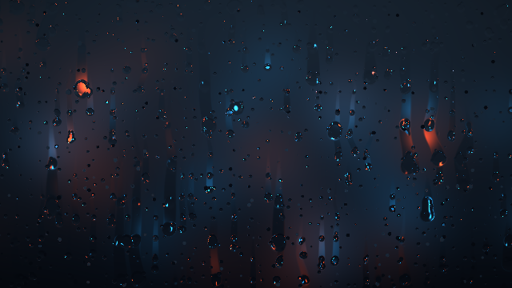

# 10. Heartfelt：雨粒と曇りガラス

[BigWIngs / Martijn Steinruckenさんの「Heartfelt」](https://www.shadertoy.com/view/ltffzl)をKodeLifeで学ぶ教材です。原作者の雨粒・軌跡を移植し、ハートになる演出は取り除いています。流体の速度や圧力を解くシミュレーションではなく、画面上の雨粒から背景の歪みとぼかしを計算する表現です。

**このシェーダーと描画例はCC BY-NC-SA 3.0（表示・非営利・継承）です。** 既存教材のMITとは異なります。[作者表記・変更点・ライセンス](../third_party/heartfelt/NOTICE.md)を確認してください。原作の背景画像と音楽・雨音は同梱していません。サンプル背景はコードで作った光なので、原作と同じ景色にはなりません。

## まず動かす

1. [READMEの準備](../README.md#0-準備する1015分)と同じOpenGL 3.2以上／GLSL 150の、画面全体を描く1 Passを使います。既存作品は別名保存します。
2. [heartfelt_kodelife.frag](../third_party/heartfelt/heartfelt_kodelife.frag)の**全文**でFragmentを置き換えます。
3. Parametersで`resolution`（vec2）をFrame → Resolutionに、`time`（float）をClockに接続します。Clockは前進・Speed 1で開始します。
4. 最初はフェードインで暗いので、10秒ほど待ちます。その後はハートに変形せず、雨が流れ続けます。

画像・Buffer・前フレームのフィードバックは不要です。`.frag`はソースで、ダブルクリックして開く`.kode`プロジェクトではありません。

## 数字を変えて観察する

ファイル先頭の設定を1つずつ変えます。

| 設定 | 値 | 観察すること |
| --- | --- | --- |
| `RAIN_AMOUNT` | `-1.0` → `0.3` / `1.0` | 雨量を固定。`-1.0`は時間で変化 |
| `TIME_OFFSET` | `0.0` → `40.0` | 雨の時間を進めて開始 |
| `CHEAP_NORMALS` | コメント解除 | 差分3回の評価を微分へ置き換え、見た目と速度を比較 |

原作のマウス操作はこの版では無効で、定数で操作します。Clockを止めて`TIME_OFFSET`を変えると静止画を比較できます。

## 仕組みを4段階で読む

### 1. 小さな静止した粒

`StaticDrops`は座標を格子に分け、`N13`で粒の位置・強さ・出現時刻をずらします。`Saw`の時間変化で、粒が生まれて消えます。前フレームの粒を保存しているわけではありません。

### 2. 下へ流れる粒と軌跡

`DropLayer2`は縦長のセルに大きい粒を配置します。列ごとに時間をずらし、横方向を蛇行させ、粒の後ろに細い軌跡を作ります。戻り値の`x`が粒の盛り上がり、`y`がガラスの曇りをぬぐった軌跡です。`Drops`で静止粒と大きさの違う2層を重ねます。

### 3. 盛り上がりを背景の歪みに変える

`Drops(uv)`と少し横・縦へ移動した位置との差から`n`を求めます。背景の参照位置を`UV+n`にずらすと、粒の表面で光が屈折するように見えます。これは厳密な光学計算ではありません。

### 4. 曇りと透明な軌跡

`focus`が背景をぼかす量です。原作は`textureLod`で背景のミップマップを読みます。移植版は初期設定で、光の広がりを数式で増やす背景に差し替えています。軌跡ができたところではぼけが減り、背景が見通せます。最後に色の変化・稲光・周辺減光・フェードを加えます。

練習：`mainImage`末尾の`fragColor`代入を一時的に`vec4(vec3(c.x), 1.)`へ変えると粒、`vec4(vec3(c.y), 1.)`にすると軌跡だけを観察できます。終わったら戻しましょう。

## 自分の写真を背景にする

`USE_IMAGE`を`1`に変更し、画像を読むTextureパラメーターを`backgroundTexture`という名前で接続します。自身が利用権を持つ画像を使ってください。画像の縦横比は出力と合わせると自然です。

**ミップマップの生成と、ミップマップを使うフィルターが必要です。** `textureLod`のLOD値を変えてもぼけない場合は設定を確認します。WrapはClampを推奨します。画像が上下逆なら入力側の反転を確認してください。入力画像が未接続なら暗くなります。迷ったら`USE_IMAGE 0`に戻せば画像なしで動きます。

画像入力の設定は環境差があるため、今回の検証対象は初期設定の手続き的背景です。元の画像や音楽を再現するためのダウンロードは行いません。

## 移植上の注意と検証

- 原作：[original.glsl](../third_party/heartfelt/original.glsl)。Shadertoy用なので、そのままKodeLifeには貼れません。
- `mainImage`を`main`から呼び、`iResolution`と`iTime`をKodeLifeの入力へ対応させています。
- 原作の逆順の`smoothstep`はGLSLで結果が未定義なので、同じ補間式を明示した`safeStep`に変更しました。端点が一致するケースも処理します。
- macOS OpenGLで移植版のコンパイル・リンクと40秒時点の描画を検証済みです。KodeLifeのUI内での接続と画像入力は未検証です。

次の練習は、雨粒のサイズや落下速度、ガラスの曇り具合を変えることです。改変を公開する場合も作者表記とCC BY-NC-SA 3.0の条件を引き継いでください。
