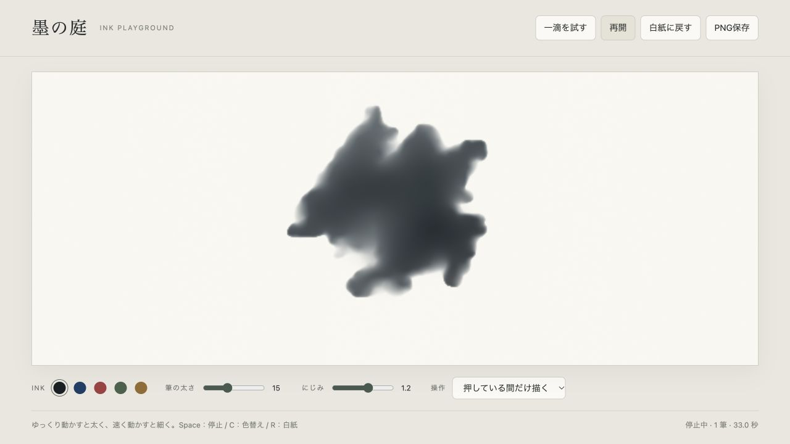

# 11. 墨の庭：触って描くインク

[単体デモをダウンロード](../inkplay/preview.html)して、ブラウザーで開いてください。GitHub上ではHTMLのソースが表示されるので、ファイルのDownload raw fileを使います。外部画像・ライブラリ・ネット接続は不要です。WebGL2と浮動小数点描画に対応するブラウザーが必要です。



## 今回の参考と作り直した点

- 見た目：[Adobe Stock / DK「Macro shot of an ink blot fills the entire screen」310354116](https://stock.adobe.com/jp/video/macro-shot-of-an-ink-blot-fills-the-entire-screen/310354116)。濃い黒の中心、周辺の薄い膜と渦、外へ広がる輪郭を参考にしました。
- 操作：[JacksonPollock.org / Miltos Manetas](https://jacksonpollock.org/)。マウスの動きが跡として重なる操作を参考にしています。

インクの流れとにじみを表現する**2D描画モデル**です。立体的な流れは[3D流体教材](09_fluid3d.md)で学べます。

従来の「決まった場所に落ちる一滴」から、「自分で落とす場所・線・色・量を決められるキャンバス」へ作り直しました。インクは自動で消えず、湿り気が減るとその場に残ります。

## 操作

| 操作 | 結果 |
| --- | --- |
| マウスを動かす | インクを連続して落とす |
| マウスを止める | その場所にたまりができる |
| 速く動かす | 細い線になる |
| キャンバスをクリックして離す | 一滴を落とし、次の色へ切り替える |
| 「押している間だけ描く」 | ドラッグ中だけ描く。クリックによる色替えは無効 |
| タッチ／ペン | 接触中だけ描く。色は色見本から選ぶ |
| 筆の太さ／にじみ | これから落とす量・広がり方を調整 |
| 一滴を試す | 中央に大きな一滴を追加する |
| 一時停止 / Space | 計算と描画入力を停止・再開 |
| PNG保存 | 現在の絵を紙の背景込みで保存 |
| 白紙に戻す / R | 現在の絵を消去する（元に戻せません） |
| C / 色見本 | 墨・藍・朱・苔・琥珀の色替え |

白紙へ戻す前に、残したい絵はPNGで保存してください。再読み込みでも絵は消えます。にじみの調整はまだ湿っている既存のインクにも作用します。ウィンドウサイズの変更では画面を合わせ、キャンバス上の絵を保持します。

## まず試す練習

1. 「一滴を試す」を押して5〜10秒観察します。中心の濃い部分と、薄い周辺の違いを見ます。
2. 白紙へ戻し、ゆっくり弧を描き、次に速く動かします。線の太さと流れの方向が変わります。
3. 藍色を重ねます。光のような加算合成ではなく、インクが重なったところが暗くなります。
4. にじみを0にして線を描き、1.5にして比較します。
5. 好きな形になったら一時停止し、PNGで保存します。

## シェーダーの読み方

ソースは[inkplay/src](../inkplay/src)、KodeLife向けGLSL 150は[inkplay/shaders](../inkplay/shaders)です。

| Pass | 役割 |
| --- | --- |
| `01_velocity` | 速度を移流。入力したインクの押し出し・手の動き・渦を加える |
| `02_divergence` | 周囲から速度の発散を計算 |
| `03_pressure` ×24 | 圧力をJacobi反復で近似 |
| `04_project` | 圧力勾配を引いて速度を補正 |
| `05_pigment` | RGBの吸光量とAの湿り気を移流・拡散・注入 |
| `06_render` | 吸光量を紙の上の色として表示 |

速度・色素・圧力は各2枚のテクスチャを交互に使います。入力を読みながら同じテクスチャへ書くことはできません。JavaScriptの`step()`がこの順番と交換を管理します。

`common.glsl`の`source()`は前回と今回の入力点を線分で結び、途中に穴が空きにくい筆跡を作ります。速度は最大値を制限し、計算は固定の1/60秒刻みです。遅いGPUでは実時間よりゆっくり進み、無理に大きな時間刻みにしません。

`05_pigment`では、湿り気の勾配に沿った外向きの移動を追加して、にじみを強調しています。この部分とノイズ由来の渦は見た目のための近似で、質量保存を保証する物理モデルではありません。乾くと動きが弱まり、色が残ります。

`06_render`の`exp(-density * 1.4)`で吸光量を色へ変換します。RGBを足して白くするのではなく、重なったインクほど背景を通さなくなります。

## KodeLifeへ持ち込む場合

まずブラウザー版で動きを確認してください。この教材の完成した操作環境はブラウザー版です。GLSLのファイルだけを1 Passへ貼っても、入力履歴と流れは再現されません。

KodeLifeではRGBA16Fの描画先・Linear/Clampのサンプラー・上記のPass順・前フレーム参照が必要です。圧力は各ステップで0から始め、24回更新します。`resolution`は各描画先の大きさ、`dt`は1/60です。画面描画だけ別解像度にできます。

| 入力 | 値 |
| --- | --- |
| `point`, `previous` | 今回と前回の位置。0〜1、左下原点 |
| `impulse` | 移動速度。計算格子のピクセル／秒 |
| `injecting` | 落とすフレームで1、それ以外0 |
| `radius` | 計算格子上の筆の半径 |
| `amount` | 一回の注入量 |
| `inkColor` | 0〜1のRGB |
| `wetness` | にじみ。0〜2 |

マウスの座標変換・前回座標の保持・ボタン操作は`app.js`が担当しています。同等の入力をKodeLife側で用意する必要があります。ネイティブ`.kode`とKodeLife UIでの配線検証は今回の範囲には含まれていません。

## 開発・検証

```sh
python3 inkplay/tools/build.py
python3 -m http.server 8766 --bind 127.0.0.1 --directory inkplay
```

ブラウザーで`http://127.0.0.1:8766/`を開きます。`src/`または`app.js`を変更したら再ビルドし、ページを再読み込みします。`preview.html`は同じコードを1ファイルへまとめた配布用です。
